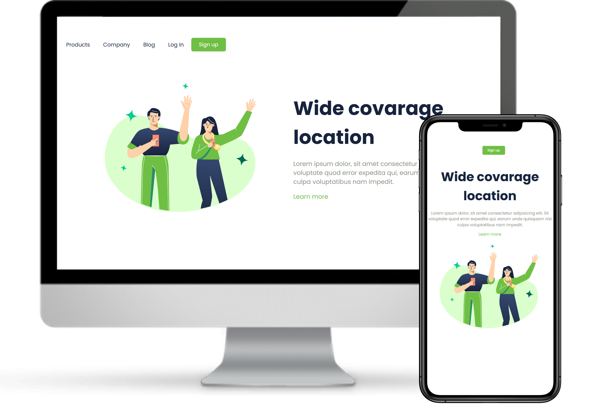

# Green Landing Page
Projeto de landing page responsiva criado exclusivamente com HTML5 e CSS3, priorizando estrutura semântica, design adaptável e código limpo.

## 💻 Demonstração

🔗 [Acesse aqui a versão online](https://victorbonifac10.github.io/green-landingpage/)

## ✨ Recursos

- HTML5
- CSS3
- Design responsivo
- Código limpo e organizado

## 📌 Observações

Este projeto foi desenvolvido com o objetivo de aprimorar habilidades em desenvolvimento front-end, explorando práticas modernas de HTML e CSS.

## 📬 Contato

- [GitHub Profile](https://github.com/VictorBonifac10) 
- [LinkedIn](https://www.linkedin.com/in/victor-alves-bonifacio/)
